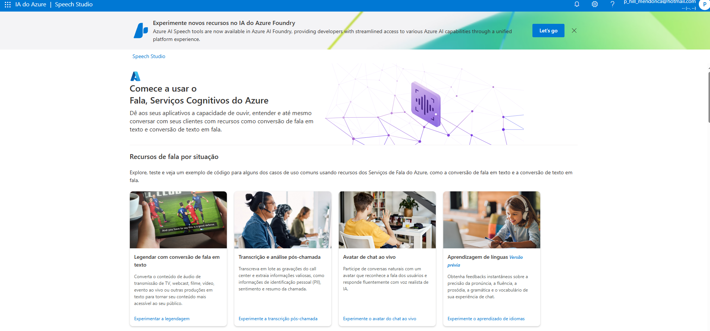

# IA_AzureTestsDio

# Azure AI Language Studio - Guia Básico

Este repositório contém um guia básico para iniciar um projeto com o Azure AI Language Studio, incluindo a criação de um recurso no Azure e a realização de testes.

##  Pré-requisitos

Antes de começar, certifique-se de ter:

- Uma conta ativa no [Microsoft Azure](https://azure.microsoft.com/)
- Acesso ao [Azure AI Language Studio](https://language.cognitive.azure.com/)
- Conhecimento básico sobre APIs e requisições HTTP

##  Criando um Projeto no Azure AI Language Studio

### 1️⃣ Criar um recurso no Azure
1. Acesse o [Portal do Azure](https://portal.azure.com/)
2. No menu de navegação, clique em **Criar um recurso**
3. Pesquise por **Azure AI Language** e selecione a opção correspondente
4. Clique em **Criar**
5. Preencha os detalhes do recurso:
   - **Grupo de Recursos**: Escolha um existente ou crie um novo
   - **Nome do Recurso**: Defina um nome único
   - **Região**: Escolha a mais próxima de sua localização
   - **Plano de Tarifas**: Selecione a opção gratuita para testes
6. Clique em **Revisar e Criar**, depois **Criar**
7. Após a criação, copie a **Chave de Acesso** e o **Endpoint** disponíveis na página do recurso

### 2️⃣ Configurar o Azure AI Language Studio
1. Acesse o [Azure AI Language Studio](https://language.cognitive.azure.com/)
2. Faça login com sua conta do Azure
3. Clique em **Criar um Projeto** e selecione o tipo de análise desejada (ex: Análise de Sentimento, Extração de Entidades, etc.)
4. Configure as credenciais copiando o **Endpoint** e a **Chave de Acesso** do recurso criado

## 🔬 Testando o Serviço



Você pode testar o serviço diretamente no Azure AI Language Studio ou via API.

### 🔹 Teste via Interface Web
1. No Language Studio, acesse seu projeto
2. Insira um texto de teste no campo correspondente
3. Clique em **Executar** para visualizar os resultados da análise

### 🔹 Teste via API com cURL
```bash
curl -X POST "<YOUR_ENDPOINT>/language/:analyze-text?api-version=2022-10-01-preview" \
     -H "Content-Type: application/json" \
     -H "Ocp-Apim-Subscription-Key: <YOUR_API_KEY>" \
     --data-raw '{
       "kind": "SentimentAnalysis",
       "parameters": {
         "modelVersion": "latest",
         "opinionMining": true
       },
       "analysisInput": {
         "documents": [
           { "id": "1", "language": "en", "text": "I love Azure AI Language Studio!" }
         ]
       }
     }'
```

### 🔹 Teste via Python
```python
import requests
import json

endpoint = "<YOUR_ENDPOINT>/language/:analyze-text?api-version=2022-10-01-preview"
api_key = "<YOUR_API_KEY>"

headers = {
    "Ocp-Apim-Subscription-Key": api_key,
    "Content-Type": "application/json"
}

data = {
    "kind": "SentimentAnalysis",
    "parameters": {
        "modelVersion": "latest",
        "opinionMining": True
    },
    "analysisInput": {
        "documents": [
            { "id": "1", "language": "en", "text": "I love Azure AI Language Studio!" }
        ]
    }
}

response = requests.post(endpoint, headers=headers, json=data)
print(json.dumps(response.json(), indent=2))
```

##  Referências
- [Documentação Oficial](https://learn.microsoft.com/en-us/azure/ai-services/language-service/)
- [Exemplos de Uso da API](https://learn.microsoft.com/en-us/azure/cognitive-services/language-service/quickstarts/)

---
